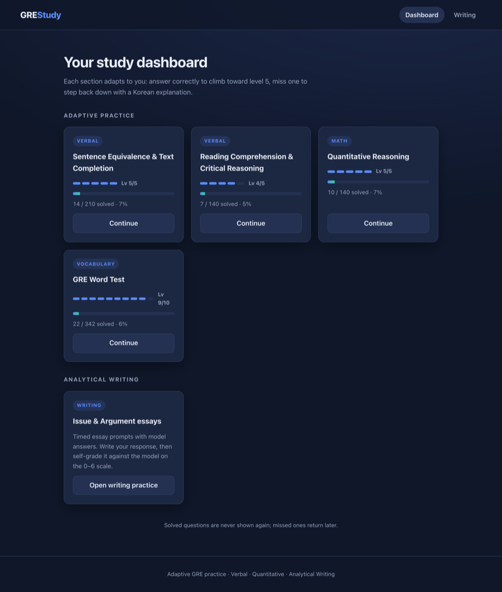
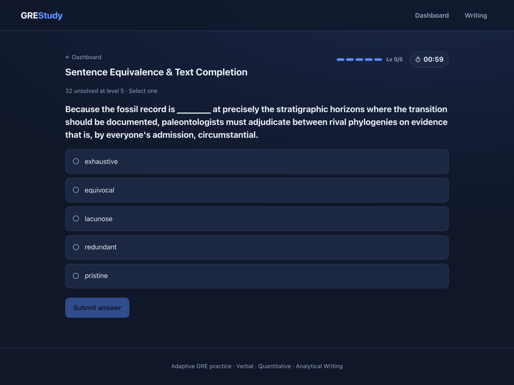
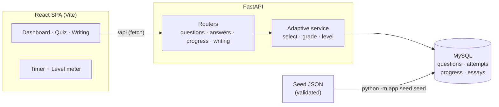

# GRE Study — Adaptive Practice Platform

A full-stack web application for self-directed GRE preparation. It serves one
question at a time and **adapts to the learner**: answer correctly and the next
question is harder; miss one and the difficulty steps back down, accompanied by
a worked explanation in Korean. Questions you solve are retired so you never see
them twice, while questions you miss return later — turning a static question
bank into a personalized study loop.

<p>
  
  
  
  
  
</p>

---

## Demo

The study dashboard tracks an independent adaptive level for each section. Below,
the levels and progress shown were produced by answering questions through the
real API — Sentence Equivalence and Quant have climbed to level 5/5, Reading to
4/5, and the Word Test to 9/10.



The adaptive question view serves one unsolved question at the section's current
level, with a per-question timer and a level meter. Submitting a correct answer
steps the level up (and retires the question); a miss steps it back down and
reveals a worked explanation in Korean.



> Screenshots are real renders of the running app (React frontend + FastAPI
> backend on a local SQLite database), captured with headless Chromium. See
> [`scripts/screenshot.mjs`](scripts/screenshot.mjs) for the capture script.

---

## Contents

- [Demo](#demo)
- [Why I built this](#why-i-built-this)
- [Features](#features)
- [The adaptive algorithm](#the-adaptive-algorithm)
- [Architecture](#architecture)
- [Tech stack](#tech-stack)
- [Project structure](#project-structure)
- [Getting started](#getting-started)
- [API reference](#api-reference)
- [Data model](#data-model)
- [Testing & CI](#testing--ci)
- [Engineering notes](#engineering-notes)
- [Roadmap](#roadmap)

---

## Why I built this

Commercial GRE apps either drill a fixed list in order or hide their adaptivity
behind a paywall. I wanted a study tool that behaves like a patient tutor —
meeting me exactly at my current level in each question type, explaining my
mistakes in my native language, and never wasting my time on questions I've
already mastered. Building it end to end (database, API, and UI) was also a way
to practice the kind of full-stack engineering I want to do in graduate school.

The bundled content is original and substantial: **490 verbal and quantitative
questions** across five difficulty levels, a **342-word GRE vocabulary Word
Test** spanning ten levels, and six Analytical Writing prompts with model
answers — every item independently re-solved and adversarially verified, with
Korean translations and explanations throughout.

## Features

- **Adaptive difficulty.** Each section tracks its own level; it rises on a
  correct answer and falls on an incorrect one. Verbal and math climb levels
  **1–5**; the vocabulary Word Test climbs **1–10**.
- **Korean explanations on every miss.** When you answer incorrectly, the worked
  solution is shown in Korean (해설) before you move on.
- **Mastery-based retirement.** A question answered correctly is never served
  again; missed questions stay in rotation until you get them.
- **Five practice modes across three adaptive sections + writing.**
  - *Verbal — Sentence Equivalence & Text Completion* (single- and two-answer)
  - *Verbal — Reading Comprehension & Critical Reasoning* (passage-based)
  - *Math — Quantitative Reasoning* (problem-solving and quantitative comparison)
  - *Vocabulary — Word Test* — pick the nearest synonym; difficulty ranges from
    common words (level 1) to rare, esoteric words (level 10).
  - *Analytical Writing* — timed Issue/Argument essays with model answers and a
    0–6 self-grading rubric.
- **Per-question timer** that warns when you exceed the target pace.
- **Progress dashboard** showing each section's level and solved/total counts.

## The adaptive algorithm

The heart of the app is a small, well-tested selection-and-leveling policy
([`backend/app/services/adaptive.py`](backend/app/services/adaptive.py)).

**Selecting the next question.** For a given section the server looks at the
learner's current level and serves a random *unsolved* question from it. If that
level is exhausted, it falls back to the **nearest** level that still has
unsolved questions (preferring the lower one on a tie), so practice never stalls
until the entire section is mastered.

```
level_sequence(current=3)  ->  [3, 2, 4, 1, 5]   # by distance, lower wins ties
```

**Updating the level.** Submissions are graded order-independently (important
for two-answer Sentence Equivalence), the attempt is recorded with its elapsed
time, and the level moves within that section's bounds:

```
correct   ->  level = min(max_level, level + 1)
incorrect ->  level = max(min_level, level - 1)
```

The engine is parameterized by **per-section level bounds** — `(1, 5)` for
verbal and math, `(1, 10)` for the vocabulary Word Test — so one code path
serves both ladders. The bounds live in
[`config.py`](backend/app/config.py).

**Retirement.** "Solved" is derived state, not a flag: a question is excluded
once it has *any* correct attempt, computed with a `NOT IN (SELECT question_id
FROM attempts WHERE correct)` subquery. This keeps the read model honest even if
attempts are added out of band.

### Does it converge? (evaluation)

The up-one / down-one rule is intentionally simple — a classic **staircase**
method, not a psychometric (IRT) model. To check that it actually homes in on a
learner's level rather than wandering, the repo ships a database-free simulation
([`backend/app/services/simulation.py`](backend/app/services/simulation.py))
that drives a *synthetic learner* of known latent ability through the exact same
rule. The learner answers a question of difficulty `level` correctly with
logistic probability `1 / (1 + e^-(ability - level))`, so it is a coin-flip when
`ability == level`.

Running `make sim` (`python -m app.services.simulation`) reports the level the
ladder settles on, averaged over a 2000-step run (seeded, reproducible) on the
1–5 ladder:

| true ability | settled level | abs. error |
| ------------ | ------------- | ---------- |
| 2.0          | 2.26          | 0.26       |
| 2.5          | 2.60          | 0.10       |
| 3.0          | 3.06          | 0.06       |
| 3.5          | 3.43          | 0.07       |
| 4.0          | 3.85          | 0.15       |

Inside the range the ladder recovers the learner's ability to well under half a
level; the error grows toward the **floor and ceiling** (e.g. ~0.6 at ability
1.0 or 5.0) because a bounded staircase cannot represent an ability outside the
levels it offers. This is the expected, honest behaviour of a simple up-down
rule, and the simulation is unit-tested in
[`tests/test_simulation.py`](backend/tests/test_simulation.py). A psychometric
ability estimator (IRT/Elo) is on the [roadmap](#roadmap).

## Architecture



The frontend is a single-page app that talks to the backend exclusively over a
small JSON API under `/api` (proxied by Vite in development). The backend keeps
HTTP concerns in thin routers and all the study logic in a service layer, so the
rules can be unit-tested without a web server or a database server.

## Tech stack

| Layer    | Choice                          | Notes                                            |
| -------- | ------------------------------- | ------------------------------------------------ |
| Frontend | React 18 + Vite, React Router   | SPA, fetch-based API client, no UI framework     |
| Backend  | FastAPI, Pydantic v2            | Typed request/response models, auto OpenAPI docs |
| ORM      | SQLAlchemy 2.0 (typed mappings) | `Mapped[...]` models, JSON columns for choices   |
| Database | MySQL 8.4 (or SQLite)           | MySQL via Docker Compose; SQLite for a no-setup run |
| Tooling  | pytest + coverage, ruff, mypy   | Tests, lint/format, and type checks — all gated in CI |

## Project structure

```
gre/
├── backend/
│   ├── app/
│   │   ├── main.py                # app entry, CORS, router registration
│   │   ├── config.py              # env-driven settings + per-section level bounds
│   │   ├── database.py            # SQLAlchemy engine/session + Base
│   │   ├── models.py              # ORM models
│   │   ├── schemas.py             # Pydantic schemas (answer key hidden)
│   │   ├── routers/               # questions · answers · progress · writing
│   │   ├── services/
│   │   │   ├── adaptive.py        # selection + leveling policy
│   │   │   └── simulation.py      # offline convergence harness
│   │   └── seed/                  # JSON question bank + validate/seed scripts
│   ├── tests/                     # pytest suite (SQLite, no server needed)
│   ├── pyproject.toml             # ruff + mypy + coverage config
│   ├── .env.example               # sample environment settings
│   └── requirements*.txt
├── frontend/
│   └── src/
│       ├── pages/                 # Home · Quiz · Writing
│       ├── components/            # Timer · LevelMeter · StateMessage
│       ├── hooks/useTimer.js
│       └── api.js                 # API client
├── .github/workflows/ci.yml
├── Makefile                       # setup · test · lint · typecheck · run
└── docker-compose.yml             # local MySQL
```

## Getting started

**Prerequisites:** Python 3.13+ and Node.js 20+. Docker is optional — it is only
needed for the MySQL setup; the quickstart below uses SQLite and needs nothing
else.

### Quickstart (no Docker, SQLite)

To clone, seed, and run the API with zero external services:

```bash
cd backend
cp .env.example .env                          # then set GRE_DATABASE_URL=sqlite:///./gre.db
python -m venv .venv && source .venv/bin/activate
pip install -r requirements-dev.txt
python -m app.seed.seed                        # load the question bank, Word Test, and prompts
uvicorn app.main:app --reload                  # http://localhost:8000  (docs at /docs)
```

A `Makefile` wraps the common tasks: `make setup`, `make seed`, `make backend`,
`make frontend`, `make test`, and `make check` (lint + type-check + validate +
tests). Run `make help` for the full list.

### Full setup with MySQL

```bash
docker compose up -d              # starts MySQL 8.4 with the default .env URL
cd backend
python -m venv .venv && source .venv/bin/activate
pip install -r requirements-dev.txt
python -m app.seed.seed
uvicorn app.main:app --reload     # http://localhost:8000  (docs at /docs)
```

> The credentials in `docker-compose.yml` (`gre` / `gre`) are throwaway
> local-development defaults, not secrets.

### Run the frontend

```bash
cd frontend
npm install
npm run dev                       # http://localhost:5173
```

Open <http://localhost:5173> and start studying. All backend settings are read
from the environment (see `backend/.env.example`); `GRE_DATABASE_URL` selects the
database and `GRE_CORS_ORIGINS` the allowed front-end origins.

## API reference

All endpoints are namespaced under `/api`; interactive documentation is
generated automatically at `/docs`.

| Method | Path                          | Purpose                                                    |
| ------ | ----------------------------- | ---------------------------------------------------------- |
| `GET`  | `/questions/next?subgroup=`   | Next unsolved question at the current (or nearest) level; reports `max_level` |
| `POST` | `/answers`                    | Grade a submission; returns correctness, Korean explanation, and the new level |
| `GET`  | `/progress`                   | Per-section level (with its ceiling) and solved/total counts |
| `GET`  | `/writing/prompts`            | List essay prompts with how many essays were written       |
| `GET`  | `/writing/prompts/{id}`       | A prompt including its model answer                         |
| `POST` | `/writing/essays`             | Save an essay with a 0–6 self-grade                         |
| `GET`  | `/writing/essays`             | Essay history (optionally filtered by prompt)              |

Valid `subgroup` values: `se_tc`, `reading_reasoning`, `quant`, `vocabulary`.
`GET /questions/next` deliberately omits the answer key and explanation from its
response so the client cannot reveal the answer before the learner submits.

## Data model

| Table             | Key columns                                                              |
| ----------------- | ----------------------------------------------------------------------- |
| `questions`       | group, subgroup, level, question_type, select_count, passage, choices (JSON), answer (JSON), explanation_ko |
| `attempts`        | question_id, selected (JSON), correct, elapsed_seconds, created_at      |
| `progress`        | subgroup (PK), current_level                                            |
| `writing_prompts` | task_type, prompt_text, model_answer, suggested_minutes                 |
| `essays`          | prompt_id, essay_text, self_grade, elapsed_seconds, created_at          |

The content bank ships as JSON under `backend/app/seed/data/`, organized by
section and level, so it can grow without code changes. Every file is validated
(answer indices in range, `select_count` consistency, level within the section's
bounds, Korean explanations present) before it can be seeded or merged.

## Testing & CI

```bash
cd backend
pytest --cov=app                 # unit + API tests with coverage
ruff check app tests             # lint + import order
ruff format --check app tests    # formatting
mypy                             # static type check (app package)
python -m app.seed.validate      # validate the content bank
```

The test suite (76 tests) runs against in-memory SQLite via a FastAPI dependency
override, so the full API, the adaptive logic, and the convergence simulation
are exercised without a running server or MySQL. The core selection/leveling
engine (`services/adaptive.py`) is at 100% line coverage.

[GitHub Actions](.github/workflows/ci.yml) gates every push and pull request on
the full backend pipeline — **ruff** (lint + format), **mypy** (types),
**seed-data validation**, and **pytest** with a coverage floor — plus the
production frontend build.

## Engineering notes

A few decisions worth calling out:

- **Logic isolated from transport.** The leveling and selection rules live in a
  service module with no FastAPI or HTTP types, which is what makes them cheap to
  unit-test and easy to reason about.
- **One engine, two ladders.** Rather than special-casing vocabulary, the
  difficulty range is a parameter, so the 1–5 and 1–10 sections share a single
  tested code path.
- **Answer keys never leave the server early.** The next-question schema simply
  has no field for the answer or explanation; they are only returned *after* a
  submission. The grader also bounds-checks selected indices.
- **Derived mastery over mutable flags.** Whether a question is "solved" is
  computed from the attempts table rather than stored, avoiding a class of
  state-drift bugs.
- **Validated, data-driven content.** Questions are data, not code; a schema
  validator gates them so a malformed item fails fast in CI instead of at
  runtime.

## Roadmap

- Spaced-repetition scheduling for missed questions
- Section-level analytics (accuracy and pace over time)
- Optional accounts so multiple learners can keep separate progress
- LLM-assisted scoring for written essays

---

<sub>Built by Heojun Hur as a full-stack engineering project. All question
content is original and intended for study practice.</sub>
